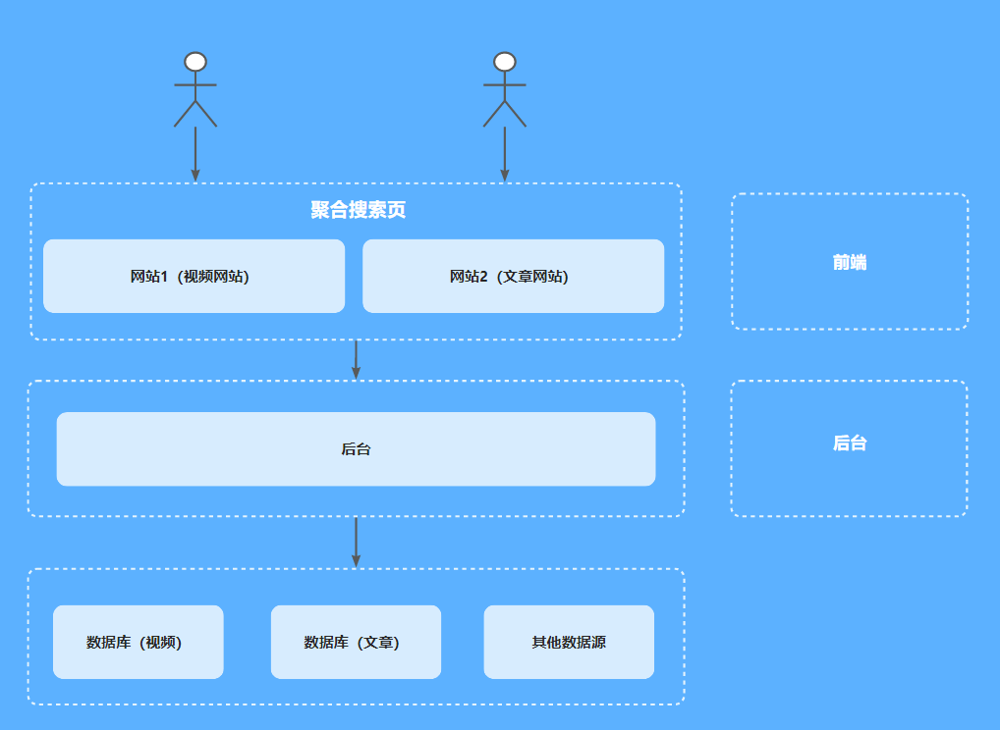
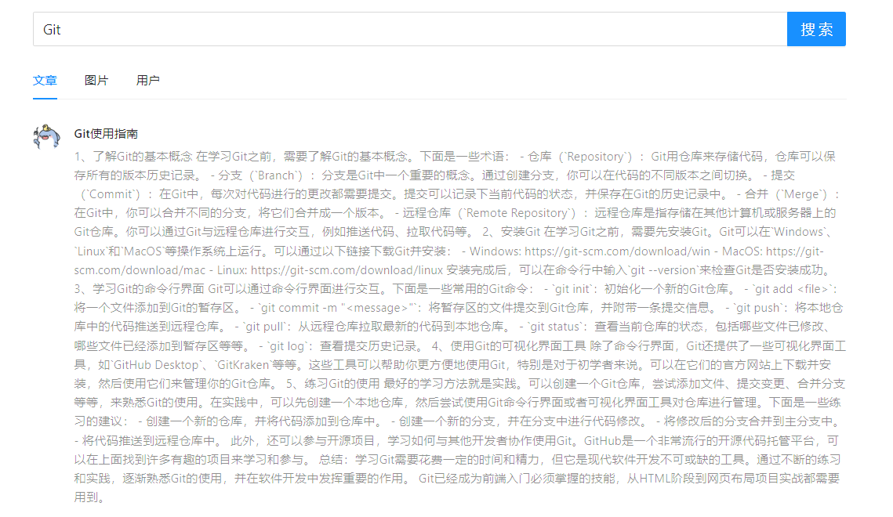
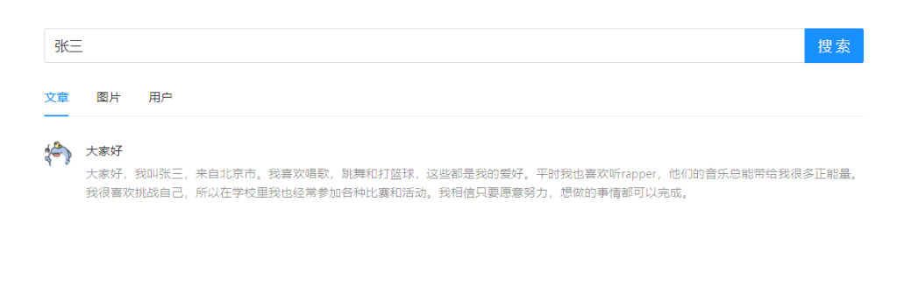
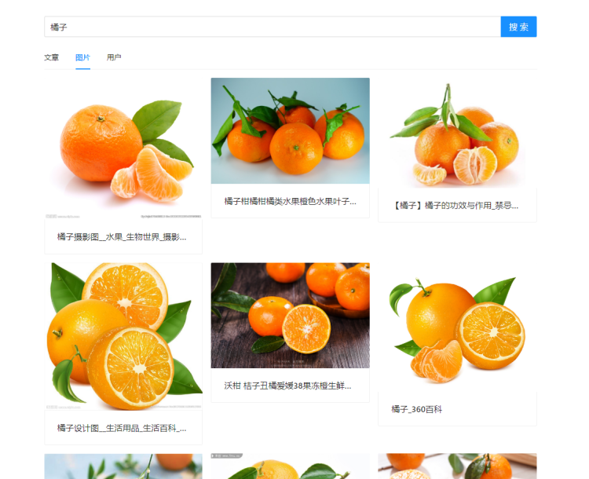
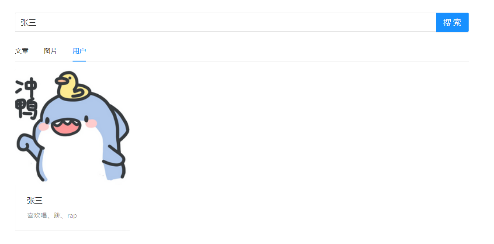

## 项目描述
聚合搜索平台，可以让用户在同一个页面集中搜索不同来源、不同类型的内容（文章、图片等）。

## 技术选型
- SpringBoot
- MySQL
- MyBatis + MyBatis Plus 数据访问（开启分页）
- ElasticSearch 
- Logstash
- Kibana
- 数据抓取同步（Hutool、Jsoup、Logstash）
- Swagger + Knife4j 接口文档

## 架构图

## 主要功能
- 文章查询

  

  

- 图片搜索

  

  

- 用户查询

  

## 接口文档
启动项目，访问 http://localhost:8102/api/doc.html
